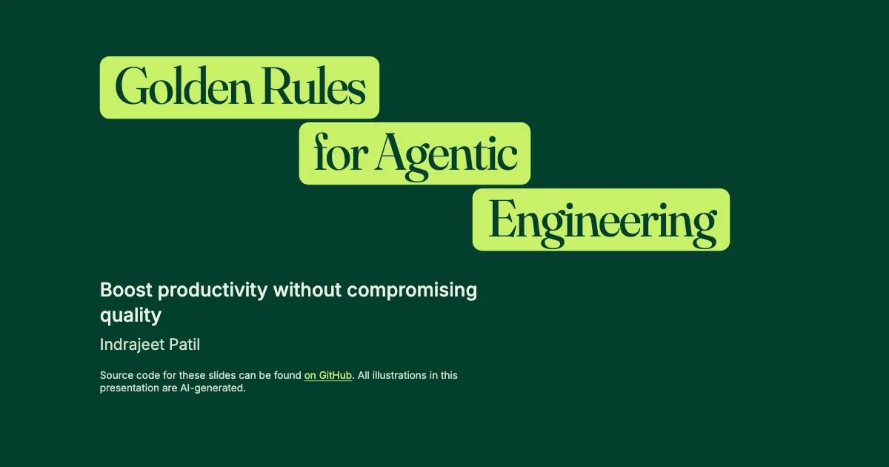

# Golden Rules for Agentic Engineering

[](https://github.com/IndrajeetPatil/agentic-engineering-golden-rules/actions/workflows/build-presentation.yaml)

This presentation distils eight golden rules for agentic engineering: using
coding agents to boost productivity without compromising quality.

1. DevEx = AgentEx
2. Guardrails: fast feedback beats orchestration
3. Intent over ceremony (the Bitter Lesson)
4. Scope control: small, reversible changes
5. Session hygiene: fresh context beats haunted context
6. Meta-automation: automate repeated agent choreography
7. Know thy tools
8. Be curious. Be humble. Be kind.

The slides will be available here once published:<br>
<https://www.indrapatil.com/agentic-engineering-golden-rules/>



## Design

The visual design is inspired by [Mode](https://mode.com/): a deep green
canvas, cream and lime cards with soft rounded corners, and a large display
face over a clean sans-serif. Headings use
[Bricolage Grotesque](https://fonts.google.com/specimen/Bricolage+Grotesque),
body text uses [Geist](https://fonts.google.com/specimen/Geist), and code uses
[Geist Mono](https://fonts.google.com/specimen/Geist+Mono). All illustrations
in the deck are AI-generated.

## Development

This project uses Python 3.14 (see `.python-version`) with [uv](https://docs.astral.sh/uv/) for dependency management, [Quarto](https://quarto.org/) for rendering slides, and [just](https://github.com/casey/just) as a command runner.

### Prerequisites

```bash
# Install just (macOS)
brew install just
```

### Setup

```bash
just install
```

### Just Commands

```bash
just help     # Show all available commands
just install  # Install Python dependencies and the a11y extension
just update   # Update Python dependencies
just render   # Render slides to HTML
just preview  # Start a live preview with auto-reload
just open     # Alias for preview (live-reload dev server over localhost)
just clean    # Remove generated files and caches
just check    # Check the Quarto and Python setup
just          # Install dependencies and start live-reload preview
```

### Accessibility

`just install` and the shared CI workflow install the latest
[`quarto-revealjs-a11y`](https://github.com/mcanouil/quarto-revealjs-a11y) directly
from upstream with `quarto add mcanouil/quarto-revealjs-a11y --no-prompt`.
The extension handles browser zoom, slide isolation, focus indicators, link
underlines, reduced motion, and screen-reader announcements. Run `just install`
again after `just clean`, which removes installed extensions.

The `accessibility.html` helper still handles scrollable code, slide-menu focus,
and vertical-slide semantics. It also carries tabset keyboard handling, which is
shared verbatim across decks and stays inert here because this deck has no
tabsets. The extension's slide-menu patch and accessibility settings panel are disabled:
version 0.2.3 introduces ARIA and contrast failures in those components.

Use `just axe` to preview with the accessibility report. Check slides, fragments,
and the menu in presentation and scroll views; the initial report does
not exercise every state. Normal builds omit the axe checker.

## Deployment

Automatic builds and GitHub Pages deployments are paused while the deck is in
progress: the workflow only runs when triggered manually from the Actions tab.
Restore the `push` and `pull_request` triggers in
`.github/workflows/build-presentation.yaml` to publish on every commit.

## Feedback

Feedback and suggestions are welcome in [the issue tracker](https://github.com/IndrajeetPatil/agentic-engineering-golden-rules/issues).
