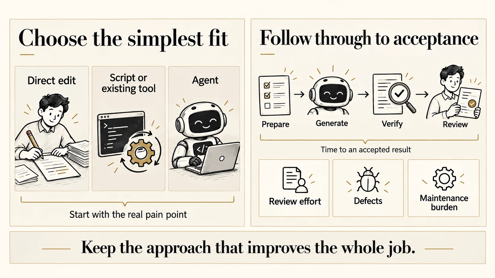
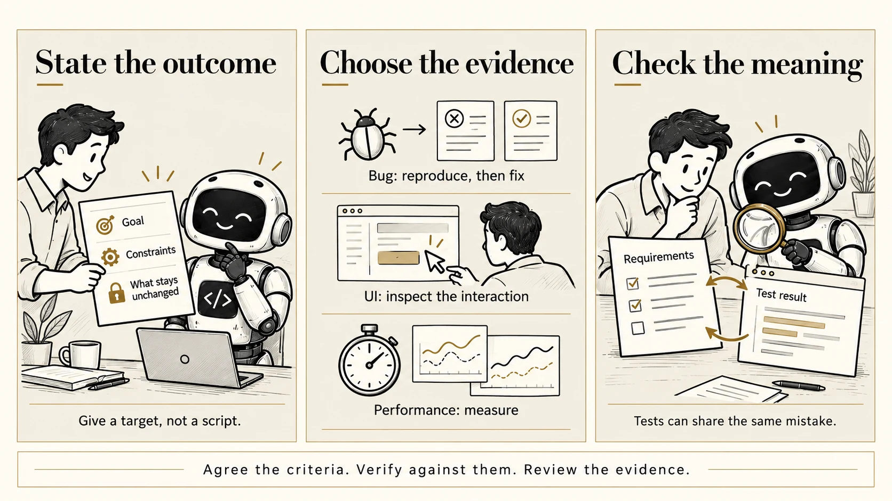
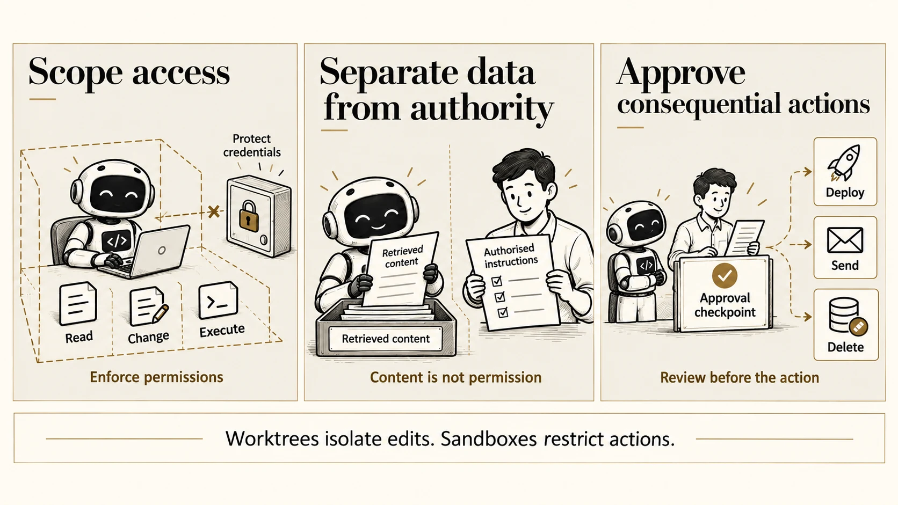
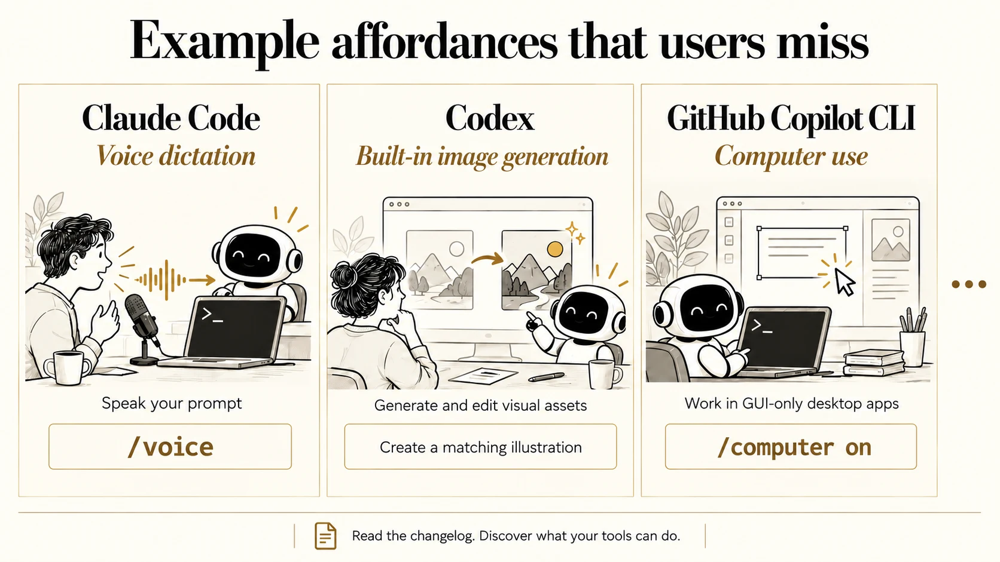

---
format:
  revealjs:
    css: style.css
    theme: simple
    revealjs-plugins:
      - a11y
    revealjs-a11y:
      # 0.2.3's menus introduce ARIA failures; retain our slide-menu handling.
      slide-menu-a11y: false
      menu: false
      # Use the extension's core accessibility fixes without extra UI/shortcuts.
      font-size-controls: false
      font-selection: false
      text-spacing: false
      transcript: false
      slide-change-cue: false
    slide-number: true
    code-line-numbers: false
    preview-links: auto
    keyboard: true
    touch: true
    help: true
    include-in-header: meta-tags.html
    include-after-body: accessibility.html
    link-external-newwindow: true
execute:
  echo: true
  eval: false
keywords: ["agentic-engineering", "coding-agents", "software-engineering", "ai-assisted-development"]
description-meta: "Golden rules for agentic engineering: how to use coding agents to boost productivity without compromising quality. Ten rules covering developer experience, guardrails, acceptance criteria, scoped permissions, reviewable changes, context, tools, automation, whole-job outcomes, and team culture."
license: "CC0 1.0 Universal"
pagetitle: "Golden Rules for Agentic Engineering"
author-meta: "Indrajeet Patil"
date-meta: "2026-10-08"
lang: "en"
dir: "ltr"
image: "media/social-media-card.webp"
image-alt: "Preview image for a presentation about golden rules for agentic engineering"
canonical-url: "https://www.indrapatil.com/agentic-engineering-golden-rules/"
jupyter: python3
---

## Golden Rules for Agentic Engineering {.title-slide-custom .sr-only-heading}

::: {.hero}

[Indrajeet Patil]{.hero-kicker}

::: {aria-hidden="true"}

[golden rules]{.hero-title}

[for agentic engineering]{.hero-title-italic}

:::

[Boost productivity without compromising quality]{.hero-subtitle}

:::

::: {.hero-source}
Source code for these slides can be found [on GitHub](https://github.com/IndrajeetPatil/agentic-engineering-golden-rules/).
All illustrations in this presentation are AI-generated.
:::

::: {.notes}
This is a practical talk, not a theoretical one. The goal is to explore how agentic software engineering can make us faster while still protecting quality.

The illustrations are AI-generated, which is intentional: the topic is hands-on use of AI as a tool.

Invite the audience to think about one area of their daily engineering work where they lose time: finding context, writing repetitive code, coordinating changes, or waiting for feedback.
:::

## Before we start

:::: {.card-grid .card-grid-3}

::: {.card .card-stone}
[Audience]{.eyebrow}

[You ship production software]{.card-title}

Tests, deployment, security, and maintenance matter.
:::

::: {.card .card-outline}
[Exception]{.eyebrow}

[Throwaway code]{.card-title}

Relax engineering rigour for disposable code; retain safeguards for real data and real actions.
:::

::: {.card .card-ink}
[Caveat]{.eyebrow}

[No panacea]{.card-title}

These are principles that sharpen judgement, not a magic recipe.
:::

::::

::: {.source}
On the risks of real actions, see [The lethal trifecta for AI agents](https://simonwillison.net/2025/Jun/16/the-lethal-trifecta/) (Willison) and [Excessive agency](https://genai.owasp.org/llmrisk/llm062025-excessive-agency/) (OWASP).
:::

::: {.notes}
Quality gates such as tests, security, deployment, and maintenance are part of the conversation. Throwaway proofs of concept, demos, and prototypes can trade engineering rigour for speed: tests, coverage, and polish can wait until the code starts to matter, which often happens sooner than planned. The consequences of running the code cannot wait. A disposable script can still expose credentials, alter real data, or send something externally, so keep scoped credentials, sandboxes, and approval before the agreed consequential actions. The aim is to sharpen judgement, not to sell a magic solution.
:::

## Golden rules {.smaller}

:::: {.card-grid .card-grid-2 .rule-index}

::: {.card}
[01]{.rule-number}

**Measure the whole job**
:::

::: {.card}
[02]{.rule-number}

**DevEx = AgentEx**
:::

::: {.card}
[03]{.rule-number}

**Define done before delegating**
:::

::: {.card}
[04]{.rule-number}

**Scope control**
:::

::: {.card}
[05]{.rule-number}

**Bound the blast radius**
:::

::: {.card}
[06]{.rule-number}

**Guardrails**
:::

::: {.card}
[07]{.rule-number}

**Session hygiene**
:::

::: {.card}
[08]{.rule-number}

**Know thy tools**
:::

::: {.card}
[09]{.rule-number}

**Meta-automation**
:::

::: {.card}
[10]{.rule-number}

**Be curious. Be humble. Be kind.**
:::

::::

## [01]{.rule-tag} Measure the whole job {.rule-slide}

[Choose the simplest approach that improves time to an accepted result.]{.lede}

{.illustration width="880" height="495" fig-alt="Two-panel illustration: choose among a direct human edit, a script or existing tool, and an agent, starting with a real pain point. Preparation, generation, verification, and review all contribute to time to an accepted result. Also track review effort, defects, and maintenance burden, and keep the approach that improves the whole job."}

::: {.source}
Simplest-solution principle: [Building effective agents](https://www.anthropic.com/engineering/building-effective-agents) (Anthropic). Why measure: in [METR's early-2025 study](https://metr.org/blog/2025-07-10-early-2025-ai-experienced-os-dev-study/), developers felt 20% faster with AI but took 19% longer.
:::

::: {.notes}
Decide whether an agent is useful before deciding how to orchestrate one. A direct human edit, an existing tool, or a deterministic script can be the simplest effective answer. Use an agent when its flexibility improves the result enough to justify the extra coordination and verification.

Anthropic recommends starting with the simplest solution and adding complexity when it demonstrably improves outcomes. This is an application of that principle to day-to-day coding work, not evidence that agents always help or always hurt.

Judge the whole job: time from preparing the task to an accepted result, human review and rework effort, defects discovered after acceptance, and maintenance burden. Generation speed and code volume omit much of this work. Include abandoned attempts and track human review time separately so faster generation does not hide extra work for colleagues.

Perception is not measurement. In METR's randomised study of 16 experienced open-source developers working on 246 real issues, developers expected AI to speed them up by 24% and afterwards believed it had sped them up by 20%, yet tasks with AI allowed took 19% longer. METR describes this as a snapshot of early-2025 tools in one setting, and its February 2026 update reports that measuring later tools reliably is harder still. The lesson is not that agents slow everyone down; it is that felt speed is an unreliable guide.

Compare similar tasks and agreed acceptance criteria. Record enough context to interpret the result: task difficulty, the approach used, and relevant conditions. A one-off anecdote cannot establish a universal productivity gain.

Start with a real pain point, try a small change in approach, and keep it when the total outcome improves. Revisit the choice as tools and team practices change.
:::

## [02]{.rule-tag} DevEx = AgentEx {.rule-slide}

[If humans hunt for context, agents burn tokens too.]{.lede}

{.illustration width="880" height="495" fig-alt="Editorial infographic: a human and a coding agent connect to the same well-designed codebase. Five panels identify clear structure (folders, names, boundaries), one-command workflows (setup, format, lint, test), deterministic QA (formatters, linters, types, tests), living documentation (README, conventions, examples), and modular design (small units, clear interfaces). Shared outcomes are speed, quality, and trust."}

::: {.notes}
What makes a codebase easy for humans makes it cheaper and safer for agents.

DevEx equals AgentEx: the same things that make a codebase easy for humans also make it easier and cheaper for agents to work in.

If developers need to hunt through unclear documentation, inconsistent commands, or hidden conventions, agents will struggle too. They burn tokens, make assumptions, or ask for more context.
:::

## DevEx = AgentEx: in practice {.rule-slide}

[One setup command. The same starting point for humans and agents.]{.lede}

{.illustration width="880" height="495" fig-alt="Two-panel illustration: on the left, a detailed ten-step project setup checklist leaves both a human developer and a coding agent confused. On the right, AGENTS.md contains a single instruction, run make setup, and the same human and agent are happy. The command encapsulates the setup procedure behind one shared entry point."}

::: {.source}
See the [AGENTS.md](https://agents.md/) convention.
:::

::: {.notes}
A long setup checklist asks every developer and agent to reconstruct the procedure: install the runtime, create an environment, install dependencies, configure variables, install hooks, start services, apply migrations, load fixtures, and verify the result.

Capture that procedure in a maintained setup command. Then AGENTS.md can point to one starting instruction: run `make setup`. Humans use the same command.

The work still happens; the command owns the sequence, checks prerequisites, and reports useful errors. Keep the implementation reproducible and the instruction current so neither humans nor agents have to guess the next step.
:::

## [03]{.rule-tag} Define done before delegating {.rule-slide}

[State the outcome, what must stay unchanged, and the evidence that will show it works.]{.lede}

{.illustration width="880" height="495" fig-alt="Three-panel illustration: a human gives a robot a brief containing the goal, constraints, and what stays unchanged; evidence is chosen to fit the task, reproducing and fixing a bug, inspecting a UI interaction, or measuring performance; a human and robot compare tests with requirements because both can share the same mistake. Agree the criteria, verify against them, and review the evidence."}

::: {.source}
On specifying success and grading outcomes rather than paths, see [Demystifying evals for AI agents](https://www.anthropic.com/engineering/demystifying-evals-for-ai-agents) (Anthropic).
:::

::: {.notes}
This combines specifying intent with defining done. Before delegating, agree an observable outcome, constraints, what must remain unchanged, and the evidence needed to accept the result. Let the agent choose the route unless the sequence itself matters.

For example: fix date parsing so invalid dates produce the documented error, preserve the public API and valid-date behaviour, and show a reproduction that fails before the fix and passes after it. Check the expected outcome against the requirement, rather than assuming the existing test is right.

Choose evidence that addresses the task. A bug needs a reproduction and a changed outcome. UI work needs inspection of the rendered interaction, including relevant keyboard and responsive states. Performance work needs comparable before-and-after measurements under stated conditions.

When the agent writes both implementation and tests, both can encode the same misunderstanding. Compare the assertions with the agreed criteria, include relevant unchanged behaviour, and inspect the actual result. More tests or higher coverage alone do not settle the question.

Agents must verify their own work: run relevant checks, inspect results, fix failures, and re-check before reporting completion. Hand over evidence tied to the criteria, including any unresolved limitations. Guardrails provide fast feedback; this rule asks whether the evidence proves the intended outcome.

Prescribe steps when their order matters, such as migrations, incident response, or a proven diagnostic workflow. Otherwise, specify the outcome and constraints, provide strong tools, and retain human review of what ships.
:::

## Define done before delegating: in practice {.smaller}

:::: {.card-grid .card-grid-3}

::: {.card .card-stone}
[Bug fix]{.eyebrow}

Reproduce the failure. Show the same case succeeding after the fix, and check relevant unchanged behaviour.
:::

::: {.card .card-outline}
[UI change]{.eyebrow}

Inspect the rendered interaction, including relevant keyboard and responsive states. A build alone cannot show this.
:::

::: {.card .card-stone}
[Performance]{.eyebrow}

Measure before and after under comparable conditions. State the workload and trade-offs.
:::

::::

::: {.card .card-ink .card-wide}
**Check the meaning of the tests.** Implementation and assertions can agree with each other while missing the requirement.
:::

::: {.source}
Bug and UI checks adapted from [Claude Code best practices](https://code.claude.com/docs/en/best-practices) (Anthropic); baselines from [Demystifying evals for AI agents](https://www.anthropic.com/engineering/demystifying-evals-for-ai-agents).
:::

::: {.notes}
Define the expected result before the implementation. Keep the acceptance criteria independent of the agent's chosen solution.

Ask for evidence that a reviewer can inspect: the reproduction and check results for a bug, the rendered interaction for a UI change, and before-and-after measurements for performance work. Check both the requested change and the behaviour that must remain unchanged.

A second agent can offer another perspective, but agreement between agents is not a substitute for checking the requirement and observable outcome.
:::

## [04]{.rule-tag} Scope control {.rule-slide}

[Small diffs beat heroic prompts.]{.lede}

{.illustration width="880" height="495" fig-alt="Two-panel illustration: an enormous prompt covering onboarding, billing, analytics, search, SSO, and migrations produces a large diff that is hard to review and reverse. Five small steps, API change, UI update, tests, docs, and deployment configuration, each have a small diff and commit. One concern at a time makes changes reviewable and reversible, with fast feedback. Small diffs beat heroic prompts."}

::: {.notes}
In brownfield projects, introduce changes in reviewable, reversible chunks.

In brownfield systems, scope control is the difference between useful automation and an unreviewable mess.
:::

## Scope control: in practice {.smaller}

:::: {.card-grid .card-grid-2}

::: {.card .card-stone}
[Why]{.eyebrow}

Agents can produce changes faster than reviewers can assess them. **Keep each change within review capacity.**
:::

::: {.card .card-stone}
[How]{.eyebrow}

Prefer narrow tasks: one bug, one refactor, one test gap, one migration step. Each chunk should be reviewable, testable, and revertible on its own.
:::

::::

::: {.card .card-ink .card-wide}
When the agent discovers broader issues, **capture them as follow-up tasks** instead of expanding the current change indefinitely.
:::

::: {.source}
See [Small CLs](https://google.github.io/eng-practices/review/developer/small-cls.html) (Google Engineering Practices).
:::

::: {.notes}
Agents are good at making many changes quickly, but reviewers need changes that are small enough to understand.

Google's code review guide lists why small changes help: they are reviewed more quickly and more thoroughly, are less likely to introduce bugs, waste less work if the direction is wrong, and are simpler to roll back. Those benefits matter more, not less, when an agent can generate a large diff in minutes.
:::

## [05]{.rule-tag} Bound the blast radius {.rule-slide}

[Limit what the agent can read, change, and execute; agree which actions need approval.]{.lede}

{.illustration width="880" height="495" fig-alt="Three-panel illustration: an agent works within enforced read, change, and execute permissions while credentials are protected; retrieved content stays separate from authorised instructions; a human approval checkpoint precedes deploying, sending, and deleting. Worktrees isolate edits, while sandboxes restrict actions."}

::: {.source}
Sources: [Git worktrees](https://git-scm.com/docs/git-worktree) · OWASP [Excessive agency](https://genai.owasp.org/llmrisk/llm062025-excessive-agency/) · [Prompt injection](https://genai.owasp.org/llmrisk/llm01-prompt-injection/).
:::

::: {.notes}
Review before merge governs the diff, but an agent can read secrets, run commands, or affect external systems before there is a diff to review. Set the operating boundary before it starts.

Define what it may read, change, and execute. Enforce the boundary with appropriate filesystem and network restrictions, limited tool access, and credentials scoped to the task. Keep unnecessary credentials out of its environment and protect secrets from prompts, logs, and generated artefacts. A written instruction alone is not an access control.

Agree which consequential actions require human approval, such as deploying, sending messages, or deleting real data, and enforce that checkpoint before the action. Approval should identify the actual target and effect. Existing explicit authorisation can cover the action; the goal is a clear boundary, not repeated permission questions for routine work.

Retrieved pages, issues, documents, and tool output are evidence to inspect. They do not gain authority to change the task or grant permissions just because the agent reads them. Clearly separate external content from authorised instructions; this reduces risk but does not make prompt injection impossible.

Git documents separate working trees and per-worktree metadata alongside shared repository data. This is separation of edits, not an operating-system access control: worktrees share the host's access and do not provide a security boundary. A sandbox must actually restrict filesystem, process, and network access to contain actions. Check the configured restrictions rather than assuming a tool's default mode supplies them.
:::

## Bound the blast radius: in practice {.smaller}

:::: {.card-grid .card-grid-3}

::: {.card .card-stone}
[Access]{.eyebrow}

Allow only the files, tools, network access, and credentials needed for the task. Enforce the limits outside the prompt.
:::

::: {.card .card-outline}
[Authority]{.eyebrow}

Treat retrieved content as data. It cannot grant permissions or override authorised instructions.
:::

::: {.card .card-stone}
[Approval]{.eyebrow}

Agree the actions that need approval, and place the checkpoint before their real effects.
:::

::::

::: {.card .card-ink .card-wide}
**Worktrees isolate edits; they do not contain actions.** Use a sandbox with enforced access limits.
:::

::: {.source}
Sources: [Git worktrees](https://git-scm.com/docs/git-worktree) · OWASP [Excessive agency](https://genai.owasp.org/llmrisk/llm062025-excessive-agency/) · [Prompt injection](https://genai.owasp.org/llmrisk/llm01-prompt-injection/).
:::

::: {.notes}
Scope control keeps changes reviewable; bounding the blast radius limits what the agent can affect while making them. Both matter, and a narrow task still needs appropriate permissions.

Start by listing necessary reads, writes, commands, and external access. Remove unused tools and credentials. Confirm that the sandbox and downstream systems enforce the agreed limits. Reserve human approval for the agreed consequential actions before they occur.
:::

## [06]{.rule-tag} Guardrails {.rule-slide}

[Fast feedback beats orchestration.]{.lede}

{.illustration width="880" height="495" fig-alt="Two-panel illustration contrasting a confused robot amid inconsistent style, flaky tests, broken assumptions, hallucinated APIs, and failed builds with a calm robot in a safety harness labelled Formatter, Linter, Type checker, Pre-commit, CI, Sanitisers, and Valgrind. Output cards show consistent style and configured gates passing for tests, types, and builds. Human review is still needed to assess requirements, behaviour, and user experience. A change flows through checks to human review; passing gates is evidence for review."}

::: {.notes}
Guardrails are more important than elaborate orchestration. Fast, deterministic feedback keeps the agent's non-determinism under control.
:::

## Guardrails: in practice {.smaller}

::: {.card .card-stone .diagram-card}

{.guardrails-workflow width="960" height="320" fig-alt="Guardrails workflow: the agent proposes a change, then deterministic checks run. On failure, precise error output returns to the agent for another attempt. On success, the change proceeds to human review, then merge."}

:::

:::: {.card-grid .card-grid-3}

::: {.card .card-outline}
[The harness]{.eyebrow}

Formatters, linters, type checkers, behaviour-focused tests, Git hooks, and security scans
:::

::: {.card .card-ink}
[One command]{.eyebrow}

`make qa` checks the agreed gates, and CI runs the **same gates**. Review checks whether we solved the right problem.
:::

::: {.card .card-stone}
[Agents optimise for green]{.eyebrow}

Never weaken a check merely to get there. Repairing a wrong gate is deliberate, reviewed work.
:::

::::

::: {.source}
See also [Harness engineering for coding agent users](https://martinfowler.com/articles/harness-engineering.html) (Böckeler, martinfowler.com).
:::

::: {.notes}
An agent can propose changes quickly, but quality comes from the harness around it: tests, linters, type checks, build commands, security scans, and reproducible local setup.

The workflow sends failed checks back to the agent with precise error output. Passing checks lead to human review before merge.

Green checks establish less than "the work is acceptable". They show that the configured gates pass, not that the requirements were right, that the tests capture them, or that the user experience works. Review answers those questions.

Agents will find the shortest path to green, including lowering a threshold or disabling a check. Do not weaken a check merely to pass. Sometimes a gate really is wrong, such as a flaky test or a rule that does not fit the code; repairing it is legitimate work, but make it a deliberate, separately reviewed change.

Coverage gates invite filler tests. Ask agents to assert behaviour at the boundaries you own (the outbound request, the streamed output, the logged event), never to execute lines for the sake of coverage.
:::

## [07]{.rule-tag} Session hygiene {.rule-slide}

[Coherent context beats haunted context.]{.lede}

{.illustration width="880" height="495" fig-alt="Three-panel illustration: a robot keeps useful context for task A and a related follow-up in the same coherent session, with one task as the default and a reset when confused; parallel tasks A and B run in separate Git worktrees from the same repository; durable conventions, decisions, and lessons move from chat history into AGENTS.md, which a new session consults. A compact handoff contains the goal, constraints, relevant files, ruled-out approaches, and acceptance checks."}

::: {.source}
Sources: [Context engineering](https://www.anthropic.com/engineering/effective-context-engineering-for-ai-agents) and [Claude Code best practices](https://code.claude.com/docs/en/best-practices) (Anthropic) · [Git worktrees](https://git-scm.com/docs/git-worktree).
:::

::: {.notes}
Keep sessions coherent, parallel tasks isolated, and durable knowledge in the repository.

Every correction, abandoned approach, and reversed decision stays in the context window. After enough of them, the agent is reasoning over contradictions.

One task per session is a useful default, not an absolute. A closely related follow-up can benefit from the reasoning and discoveries already in context, and restarting has a cost: a handoff can lose an important constraint or a failed hypothesis. Length matters as well as coherence: Anthropic describes context rot, where recall of information in the context degrades as the token count grows. Clear or compact between unrelated tasks, and restart when the context stops being coherent or is filling with material the next step does not need.

Use one Git worktree per parallel task so each task has its own working directory. Worktrees isolate edits, not permissions; apply the access limits from Bound the blast radius as well. Keep durable conventions, decisions, and lessons in the repository, for example in `AGENTS.md`, so future sessions can find them without relying on old chat history.

Signs of a haunted session include reviving a rejected approach, confusing earlier and current requirements, repeating the same correction, or continuing after the conversation has outgrown its original task. Claude Code's best practices suggest a concrete threshold: after two failed corrections on the same issue, start fresh with a better prompt.

Reset with a compact handoff: the goal in one sentence, constraints on what must not change, relevant files to start with, approaches already ruled out, and acceptance checks that show when the work is done.
:::

## [08]{.rule-tag} Know thy tools {.rule-slide}

[Sometimes the unlock is a hidden tool affordance.]{.lede}

{.illustration width="880" height="495" fig-alt="Example affordances that users miss: Claude Code voice dictation turns a spoken prompt into terminal input with /voice; Codex generates and edits visual assets; GitHub Copilot CLI computer use operates GUI-only desktop apps with /computer on. An ellipsis indicates more examples, and the footer encourages reading the changelog to discover what the tools can do."}

::: {.source}
Official docs: [Claude Code voice](https://code.claude.com/docs/en/voice-dictation) · [Codex images](https://learn.chatgpt.com/docs/image-generation) · [Copilot CLI computer use](https://docs.github.com/en/copilot/how-tos/copilot-cli/use-copilot-cli/computer-use).
:::

::: {.notes}
These are example affordances that users miss, not an exhaustive feature list or a claim that each capability is exclusive to one product. Official documentation and release notes were checked on 8 October 2026.

Claude Code voice mode is prompt dictation: `/voice` enables speech-to-text input. It requires a Claude.ai sign-in and a local microphone; it is not available with direct API-key or third-party-provider authentication, or in cloud or SSH sessions.

Codex supports built-in image generation for creating and editing visual assets alongside code, including in the CLI. Describe the desired asset and supply a reference image for an edit; `$imagegen` invokes the skill explicitly. The illustration uses the general product name because this affordance is not limited to the desktop app.

GitHub Copilot CLI computer use entered public preview on 1 October 2026. `/computer on` enables it in local sessions on macOS and Windows, subject to permissions and organisation policy. It can read, click, type, and navigate desktop interfaces. Use a direct API, CLI, MCP, or dedicated browser tool when one fits the task; computer use is useful for GUI-only workflows.

Read the changelog: a release note can remove a bottleneck you have been working around for months. Availability and commands can change, so revisit the linked official docs when updating this slide.

When results are poor, ask whether the agent had the right context, the right tools, and the right feedback.

Sometimes the limiting factor is not the model; it is the tool interface available to the model.

Agents perform better when they can inspect files, run commands, search the repository, execute tests, and see failures. If a tool is hidden, blocked, or awkward, the agent may appear less capable than it really is.
:::

## [09]{.rule-tag} Meta-automation {.rule-slide}

[Automate repeated agent choreography.]{.lede}

{.illustration width="880" height="495" fig-alt="Meta-automation infographic: repeated work is captured once, run many times, and reviewed. Four mechanisms are compared: a prompt for changing instructions, a skill for domain know-how, a slash command for a stable shortcut, and a workflow for steps and branches. A loop processes an input list, runs automation for each item, collects results, and ends with human review."}

::: {.notes}
Capture once. Run many times.

Once a useful agent workflow repeats and improves the whole job, automate the choreography around it.
:::

## Meta-automation: in practice {.rule-slide}

[Prompts, skills, shortcuts, and workflows turn repeated work into reusable automation.]{.lede}

{.illustration width="880" height="495" fig-alt="Four concrete automation examples. Prompt: update-deps.md instructs an agent to refresh dependencies, fix compatibility breaks, run QA, and prepare a draft PR. Skill: frontend-pr-screenshot packages how to preview the app, capture a screenshot, and attach it to a PR. Slash command: an illustrative /address-review shortcut invokes a saved prompt to read review threads, make warranted fixes, and reply. Workflow: vulnerability management goes from scan to triage, then asks whether a finding is worth fixing. Yes leads to fix, verify, and draft PR; no leads to recording the reason. Humans review evidence and decide what ships."}

::: {.source}
Examples adapted from [chatbot-template prompts](https://github.com/IndrajeetPatil/chatbot-template/tree/main/.github/prompts) and its [PR screenshot skill](https://github.com/IndrajeetPatil/chatbot-template/blob/main/.agents/skills/frontend-pr-screenshot/SKILL.md).
:::

::: {.notes}
These are examples of different ways to package automation, not four mutually exclusive systems. A slash command can invoke a prompt or a skill; a workflow can compose both.

The dependency-update prompt in chatbot-template refreshes dependencies, fixes compatibility breaks, runs the project's quality gates, and prepares a draft PR. The screenshot skill packages the steps for previewing the app, capturing its appearance, and attaching evidence to a PR.

The /address-review command is an illustrative shortcut to the repository's address-review.md prompt, not a claim that this checkout installs that slash command. Review comments need evaluation; make warranted fixes, verify them, and reply. Resolve only addressed comments or those confirmed to need no change.

The vulnerability-management workflow is adapted from codex-security.md. Scan findings are claims to investigate. Triage checks reachability, existing mitigations, and regression risk before deciding whether a fix is warranted. Confirmed findings with a focused, safe fix proceed to remediation, verification, and a draft PR. Other findings get a recorded reason; no code changes means no PR. Verification includes checking that the vulnerability is resolved and running relevant regression checks. Failed verification returns to the fix step.

Automate coordination: gathering context, running checks, formatting reports, and repeating the process across repositories. Humans evaluate evidence, make trade-offs, and decide what ships. Run unattended agents only in isolated sandboxes with scoped credentials.
:::

## [10]{.rule-tag} Be curious. Be humble. Be kind. {.rule-slide}

[AI is not an excuse to become incompetent or disagreeable.]{.lede}

{.illustration width="880" height="495" fig-alt="Four-panel editorial illustration: be curious, with a developer experimenting alongside a robot; avoid deskilling, with a disengaged developer leaving the robot unattended; be humble and kind, with a team listening and discussing shared notes; avoid grandiosity, with an engineer, product manager, and designer dismissing one another while pointing to their own assistants."}

::: {.notes}
AI should make us better teammates, not careless or difficult ones.

Be curious about what the tools can do, humble about their limits, and kind in how we review agent-generated work and each other's experiments.
:::

## Be curious. Be humble. Be kind: in practice {.smaller}

:::: {.card-grid .card-grid-3}

::: {.card .card-stone}
[Curious]{.card-title}

Experiment, prototype, and keep learning the fundamentals the agent is standing on.
:::

::: {.card .card-stone}
[Humble]{.card-title}

Agents are confidently wrong. So are we. Verify before you trust, including your own prompt.
:::

::: {.card .card-stone}
[Kind]{.card-title}

Review agent-generated work as carefully as human work, and review humans as kindly as ever.
:::

::::

::: {.card .card-ink .card-wide}
**AI does not remove responsibility.** You still own the design, the code, the tests, the security implications, and the communication with your team.
:::

# Making it stick

## Code generation is the easy part {.smaller}

[Everything around it needs planning, especially in teams.]{.lede}

:::: {.card-grid .card-grid-2}

::: {.card .card-stone}
[Share]{.eyebrow}

Pool your team's tips and tricks for agentic coding. Someone has already solved your annoyance.
:::

::: {.card .card-stone}
[Fix pain points]{.eyebrow}

Pick a real pain point (slow tests, unclear setup, flaky workflows). Use the simplest effective approach, and measure the whole job.
:::

::: {.card .card-stone}
[Frontload planning]{.eyebrow}

Task division, coordination, and reviewability matter more when everyone has an agent.
:::

::: {.card .card-stone}
[Challenge your habits]{.eyebrow}

Revisit your workflow as tools change. Keep changes that improve the outcome.
:::

::::

::: {.source}
Simplest-solution principle: [Building effective agents](https://www.anthropic.com/engineering/building-effective-agents) (Anthropic).
:::

::: {.notes}
Code generation is often the easy part. The hard part is planning work in a team: dividing tasks, coordinating changes, preserving quality, and making results reviewable.
:::

## Further reading {.smaller}

::: {.reading-list}

- Willison, S. [Agentic Engineering Patterns](https://simonwillison.net/guides/agentic-engineering-patterns/).

- Anthropic. [Building effective agents](https://www.anthropic.com/engineering/building-effective-agents).

- Anthropic. [Effective context engineering for AI agents](https://www.anthropic.com/engineering/effective-context-engineering-for-ai-agents).

- Anthropic. [Claude Code best practices](https://code.claude.com/docs/en/best-practices).

- Böckeler, B. [Harness engineering for coding agent users](https://martinfowler.com/articles/harness-engineering.html). martinfowler.com.

- Lopopolo, R. [Harness engineering: leveraging Codex in an agent-first world](https://openai.com/index/harness-engineering/). OpenAI.

- Beck, K. [Augmented coding: beyond the vibes](https://tidyfirst.substack.com/p/augmented-coding-beyond-the-vibes).

- Anthropic. [Demystifying evals for AI agents](https://www.anthropic.com/engineering/demystifying-evals-for-ai-agents).

- OWASP. [Excessive agency](https://genai.owasp.org/llmrisk/llm062025-excessive-agency/) and [Prompt injection](https://genai.owasp.org/llmrisk/llm01-prompt-injection/).

- Git. [git-worktree manual](https://git-scm.com/docs/git-worktree).

- [AGENTS.md](https://agents.md/): a simple, open format for guiding coding agents.

:::

# Thank You

Go forth and delegate responsibly.

 

::: {style="text-align: center; font-size: 0.7em;"}

Check out my other [slide decks](https://www.indrapatil.com/presentations/) on software development best practices

:::

::: {style="text-align: center; font-size: 1em;"}

<a class="deck-icon-link" href="https://www.linkedin.com/in/indrajeet-patil-ph-d-397865174/" aria-label="LinkedIn"></a>
&nbsp;&nbsp;
<a class="deck-icon-link" href="http://github.com/IndrajeetPatil" aria-label="GitHub"></a>
&nbsp;&nbsp;
<a class="deck-icon-link" href="mailto:patilindrajeet.science@gmail.com" aria-label="Email"></a>

:::
