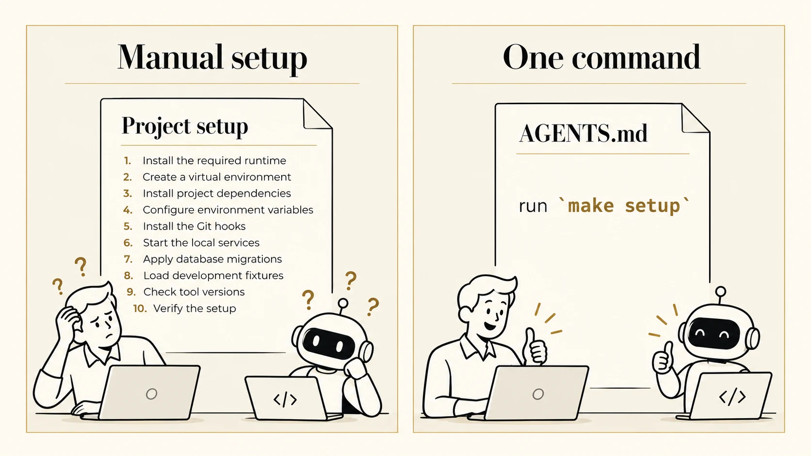
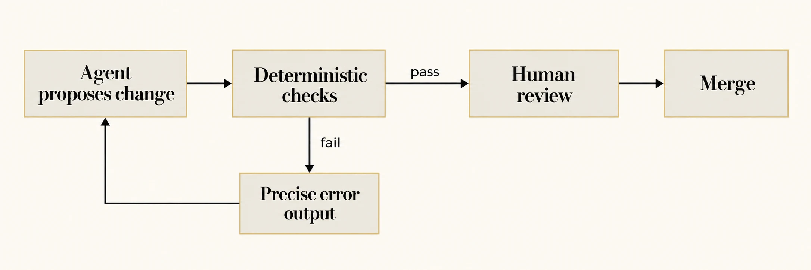
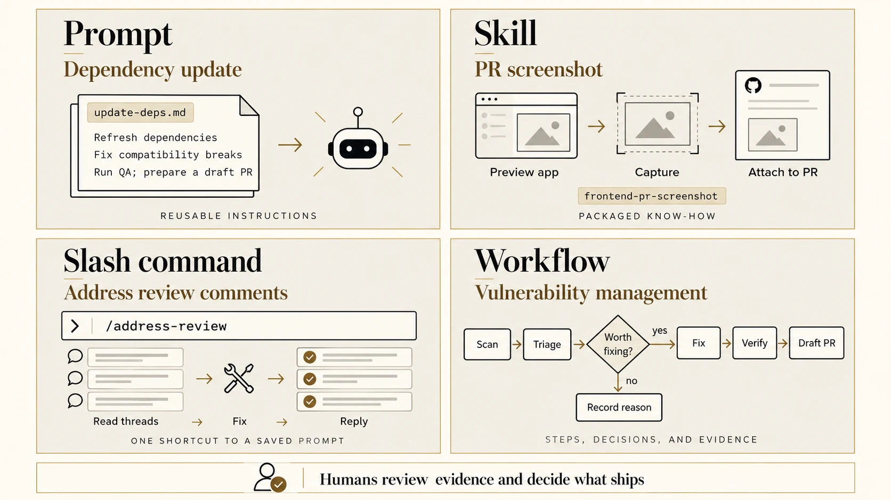

---
format:
  revealjs:
    css: style.css
    theme: simple
    revealjs-plugins:
      - a11y
    revealjs-a11y:
      # 0.2.3's menus introduce ARIA failures; retain our slide-menu handling.
      slide-menu-a11y: false
      menu: false
      # Use the extension's core accessibility fixes without extra UI/shortcuts.
      font-size-controls: false
      font-selection: false
      text-spacing: false
      transcript: false
      slide-change-cue: false
    slide-number: true
    code-line-numbers: false
    preview-links: auto
    keyboard: true
    touch: true
    help: true
    include-in-header: meta-tags.html
    include-after-body: accessibility.html
    link-external-newwindow: true
execute:
  echo: true
  eval: false
keywords: ["agentic-engineering", "coding-agents", "software-engineering", "ai-assisted-development"]
description-meta: "Golden rules for agentic engineering: how to use coding agents to boost productivity without compromising quality. Covers developer experience, deterministic guardrails, intent over ceremony, scope control, session hygiene, tool affordances, meta-automation, and team culture."
license: "CC0 1.0 Universal"
pagetitle: "Golden Rules for Agentic Engineering"
author-meta: "Indrajeet Patil"
date-meta: "2026-10-08"
lang: "en"
dir: "ltr"
image: "media/social-media-card.webp"
image-alt: "Preview image for a presentation about golden rules for agentic engineering"
canonical-url: "https://www.indrapatil.com/agentic-engineering-golden-rules/"
jupyter: python3
---

## Golden Rules for Agentic Engineering {.title-slide-custom .sr-only-heading}

::: {.hero}

[Indrajeet Patil]{.hero-kicker}

::: {aria-hidden="true"}

[golden rules]{.hero-title}

[for agentic engineering]{.hero-title-italic}

:::

[Boost productivity without compromising quality]{.hero-subtitle}

:::

::: {.hero-source}
Source code for these slides can be found [on GitHub](https://github.com/IndrajeetPatil/agentic-engineering-golden-rules/).
All illustrations in this presentation are AI-generated.
:::

::: {.notes}
This is a practical talk, not a theoretical one. The goal is to explore how agentic software engineering can make us faster while still protecting quality.

The illustrations are AI-generated, which is intentional: the topic is hands-on use of AI as a tool.

Invite the audience to think about one area of their daily engineering work where they lose time: finding context, writing repetitive code, coordinating changes, or waiting for feedback.
:::

## Before we start

:::: {.card-grid .card-grid-2}

::: {.card .card-stone}
[Audience]{.eyebrow}

[You ship production software]{.card-title}

Tests, deployment, security, and maintenance matter.
:::

::: {.card .card-ink}
[Caveat]{.eyebrow}

[No panacea]{.card-title}

These are principles that sharpen judgement, not a magic recipe.
:::

::::

::: {.notes}
Quality gates such as tests, security, deployment, and maintenance are part of the conversation. The aim is to sharpen judgement, not to sell a magic solution.
:::

## Golden rules {.smaller}

:::: {.card-grid .card-grid-4 .rule-index}

::: {.card}
[01]{.rule-number}

**DevEx = AgentEx**
:::

::: {.card}
[02]{.rule-number}

**Guardrails**
:::

::: {.card}
[03]{.rule-number}

**The Bitter Lesson**
:::

::: {.card}
[04]{.rule-number}

**Scope control**
:::

::: {.card}
[05]{.rule-number}

**Session hygiene**
:::

::: {.card}
[06]{.rule-number}

**Know thy tools**
:::

::: {.card}
[07]{.rule-number}

**Meta-automation**
:::

::: {.card}
[08]{.rule-number}

**Be curious. Be humble. Be kind.**
:::

::::

# [Rule 01]{.section-eyebrow} DevEx = AgentEx

If humans hunt for context, agents burn tokens too.

## [01]{.rule-tag} DevEx = AgentEx {.rule-slide}

[What makes a codebase easy for humans makes it cheaper and safer for agents.]{.lede}

{.illustration width="880" height="495" fig-alt="Editorial infographic: a human and a coding agent connect to the same well-designed codebase. Five panels identify clear structure (folders, names, boundaries), one-command workflows (setup, format, lint, test), deterministic QA (formatters, linters, types, tests), living documentation (README, conventions, examples), and modular design (small units, clear interfaces). Shared outcomes are speed, quality, and trust."}

::: {.notes}
DevEx equals AgentEx: the same things that make a codebase easy for humans also make it easier and cheaper for agents to work in.

If developers need to hunt through unclear documentation, inconsistent commands, or hidden conventions, agents will struggle too. They burn tokens, make assumptions, or ask for more context.
:::

## DevEx = AgentEx: in practice {.rule-slide}

[One setup command. The same starting point for humans and agents.]{.lede}

{.illustration width="880" height="495" fig-alt="Two-panel illustration: on the left, a detailed ten-step project setup checklist leaves both a human developer and a coding agent confused. On the right, AGENTS.md contains a single instruction, run make setup, and the same human and agent are happy. The command encapsulates the setup procedure behind one shared entry point."}

::: {.source}
See the [AGENTS.md](https://agents.md/) convention.
:::

::: {.notes}
A long setup checklist asks every developer and agent to reconstruct the procedure: install the runtime, create an environment, install dependencies, configure variables, install hooks, start services, apply migrations, load fixtures, and verify the result.

Capture that procedure in a maintained setup command. Then AGENTS.md can point to one starting instruction: run `make setup`. Humans use the same command.

The work still happens; the command owns the sequence, checks prerequisites, and reports useful errors. Keep the implementation reproducible and the instruction current so neither humans nor agents have to guess the next step.
:::

# [Rule 02]{.section-eyebrow} Guardrails

Fast feedback beats orchestration.

## [02]{.rule-tag} Guardrails {.rule-slide}

[Use a deterministic harness to keep the agent's non-determinism in check.]{.lede}

{.illustration width="880" height="495" fig-alt="Two-panel illustration contrasting a confused robot amid inconsistent style, flaky tests, broken assumptions, hallucinated APIs, and failed builds with a calm robot in a safety harness labelled Formatter, Linter, Type checker, Pre-commit, CI, Sanitisers, and Valgrind. Orderly outputs show consistent code, passing tests, and quality gates. Deterministic inputs and checks lead to consistent outcomes."}

::: {.notes}
Guardrails are more important than elaborate orchestration. Fast, deterministic feedback keeps the agent's non-determinism under control.
:::

## Guardrails: in practice {.smaller}

::: {.card .card-stone .diagram-card}

{.guardrails-workflow width="960" height="320" fig-alt="Guardrails workflow: the agent proposes a change, then deterministic checks run. On failure, precise error output returns to the agent for another attempt. On success, the change proceeds to human review, then merge."}

:::

:::: {.card-grid .card-grid-3}

::: {.card .card-outline}
[The harness]{.eyebrow}

Formatters, linters, type checkers, tests with coverage gates, Git hooks, and security scans
:::

::: {.card .card-ink}
[One command]{.eyebrow}

`make qa` says whether the work is acceptable, and CI runs the **same gates**
:::

::: {.card .card-stone}
[Agents optimise for green]{.eyebrow}

Never lower a threshold or disable a check to get there
:::

::::

::: {.source}
See also [Harness engineering for coding agent users](https://martinfowler.com/articles/harness-engineering.html) (Böckeler, martinfowler.com).
:::

::: {.notes}
An agent can propose changes quickly, but quality comes from the harness around it: tests, linters, type checks, build commands, security scans, and reproducible local setup.

The workflow sends failed checks back to the agent with precise error output. Passing checks lead to human review before merge.

Coverage gates invite filler tests. Ask agents to assert behaviour at the boundaries you own (the outbound request, the streamed output, the logged event), never to execute lines for the sake of coverage.
:::

# [Rule 03]{.section-eyebrow} The Bitter Lesson

Strong models need intent, not ceremony.

## [03]{.rule-tag} The Bitter Lesson {.rule-slide}

[Do not get in the model's way.]{.lede}

{.illustration width="880" height="495" fig-alt="Ceremony versus intent. A confused robot follows a prescribed route: open utils.py at line 40, add a try block, add exactly three tests, use single quotes, and do not deviate. An engaged robot receives an outcome and constraints: fix the failing date-parsing test, preserve the public API, keep the diff small, and explain any trade-off. Strong tools include search, docs, debugger, formatter, linter, type checker, tests, and CI. The agent verifies its own work by inspecting test, type, and build results. A single feedback loop shows Explore: inspect and try; Check: run checks and inspect results; Adapt: fix failures and re-check."}

::: {.source}
Inspired by Rich Sutton's essay [The Bitter Lesson](http://www.incompleteideas.net/IncIdeas/BitterLesson.html) (2019).
:::

::: {.notes}
The bitter lesson here is that stronger models usually need clearer intent, not more ceremony. Do not get in the model's way by prescribing every implementation step.

Ceremony: "Open utils.py. Find the function on line 40. Add a try block. Then open the test file and add three tests. Use single quotes. Do not deviate from these steps." This over-specifies the route and leaves no room for the model to reason about a better one.

Intent: "Fix the failing date-parsing test without changing the public API. Keep the diff small, and explain any trade-off." This states the outcome, constraints, acceptance criteria, and what must not change.

Strong tools matter, and agents must use them to verify their own work: run the relevant checks, inspect the results, fix failures, and re-check before reporting completion. The Explore, Check, Adapt loop shows this responsibility explicitly.

Specify implementation steps only when they genuinely matter. Otherwise, give the agent a target, constraints, strong tools, and responsibility for verification. Passing checks still leaves humans responsible for review and what ships.
:::

# [Rule 04]{.section-eyebrow} Scope control

Small diffs beat heroic prompts.

## [04]{.rule-tag} Scope control {.rule-slide}

[In brownfield projects, introduce changes in reviewable, reversible chunks.]{.lede}

{.illustration width="880" height="495" fig-alt="Two-panel illustration: an enormous prompt covering onboarding, billing, analytics, search, SSO, and migrations produces a large diff that is hard to review and reverse. Five small steps, API change, UI update, tests, docs, and deployment configuration, each have a small diff and commit. One concern at a time makes changes reviewable and reversible, with fast feedback. Small diffs beat heroic prompts."}

::: {.notes}
In brownfield systems, scope control is the difference between useful automation and an unreviewable mess.
:::

## Scope control: in practice {.smaller}

:::: {.card-grid .card-grid-2}

::: {.card .card-stone}
[Why]{.eyebrow}

Agents can change a lot of code quickly. Reviewers cannot review a lot of code quickly. **Review capacity is the bottleneck**, not generation speed.
:::

::: {.card .card-stone}
[How]{.eyebrow}

Prefer narrow tasks: one bug, one refactor, one test gap, one migration step. Each chunk should be reviewable, testable, and revertible on its own.
:::

::::

::: {.card .card-ink .card-wide}
When the agent discovers broader issues, **capture them as follow-up tasks** instead of expanding the current change indefinitely.
:::

::: {.notes}
Agents are good at making many changes quickly, but reviewers need changes that are small enough to understand.
:::

# [Rule 05]{.section-eyebrow} Session hygiene

Fresh context beats haunted context.

## [05]{.rule-tag} Session hygiene {.rule-slide}

[Keep sessions focused, parallel tasks isolated, and durable knowledge in the repository.]{.lede}

{.illustration width="880" height="495" fig-alt="Three-panel illustration: one task per session gives a robot fresh context and clear focus; parallel tasks A and B run in separate Git worktrees from the same repository; durable conventions, decisions, and lessons move from chat history into AGENTS.md, which a new session consults. A compact handoff contains the goal, constraints, relevant files, and acceptance checks."}

::: {.source}
See [Effective context engineering for AI agents](https://www.anthropic.com/engineering/effective-context-engineering-for-ai-agents) (Anthropic).
:::

::: {.notes}
Every correction, abandoned approach, and reversed decision stays in the context window. After enough of them, the agent is reasoning over contradictions.

Run one task per session, and use one Git worktree per parallel task so each task has its own working directory. Keep durable conventions, decisions, and lessons in the repository, for example in `AGENTS.md`, so future sessions can find them without relying on old chat history.

Signs of a haunted session include reviving a rejected approach, confusing earlier and current requirements, repeating the same correction, or continuing after the conversation has outgrown its original task.

Reset with a compact handoff: the goal in one sentence, constraints on what must not change, relevant files to start with, and acceptance checks that show when the work is done.
:::

# [Rule 06]{.section-eyebrow} Know thy tools

Sometimes the unlock is a hidden tool affordance.

## [06]{.rule-tag} Know thy tools {.smaller}

[When results are poor, ask whether the agent had the right **context**, the right **tools**, and the right **feedback**.]{.lede}

::: {.table-card}

| Coding agent | Affordances users often miss |
|--------------|------------------------------|
| **Claude Code** | `ultrathink` keyword · worktree lifecycle management · plan mode · hooks · skills · subagents |
| **GitHub Copilot CLI** | `/chronicle` · rubber-duck review · voice mode · custom agents · cloud agent delegation |
| **Any agent** | Permission allowlists · custom instructions · MCP servers · session resume and compaction |

:::

::: {.card .card-ink .card-wide}
Read the changelog: a release note can remove a bottleneck you have been working around for months.
:::

::: {.source}
See [Claude Code best practices](https://code.claude.com/docs/en/best-practices) and [Using GitHub Copilot CLI](https://docs.github.com/en/copilot/how-tos/use-copilot-agents/use-copilot-cli).
:::

::: {.notes}
Sometimes the limiting factor is not the model; it is the tool interface available to the model.

Agents perform better when they can inspect files, run commands, search the repository, execute tests, and see failures. If a tool is hidden, blocked, or awkward, the agent may appear less capable than it really is.
:::

# [Rule 07]{.section-eyebrow} Meta-automation

Automate repeated agent choreography.

## [07]{.rule-tag} Meta-automation {.rule-slide}

[Capture once. Run many times.]{.lede}

{.illustration width="880" height="495" fig-alt="Meta-automation infographic: repeated work is captured once, run many times, and reviewed. Four mechanisms are compared: a prompt for changing instructions, a skill for domain know-how, a slash command for a stable shortcut, and a workflow for steps and branches. A loop processes an input list, runs automation for each item, collects results, and ends with human review."}

::: {.notes}
Once a useful agent workflow repeats, automate the choreography around it.
:::

## Meta-automation: in practice {.rule-slide}

[Prompts, skills, shortcuts, and workflows turn repeated work into reusable automation.]{.lede}

{.illustration width="880" height="495" fig-alt="Four concrete automation examples. Prompt: update-deps.md instructs an agent to refresh dependencies, fix compatibility breaks, run QA, and prepare a draft PR. Skill: frontend-pr-screenshot packages how to preview the app, capture a screenshot, and attach it to a PR. Slash command: an illustrative /address-review shortcut invokes a saved prompt to read review threads, make warranted fixes, and reply. Workflow: vulnerability management goes from scan to triage, then asks whether a finding is worth fixing. Yes leads to fix, verify, and draft PR; no leads to recording the reason. Humans review evidence and decide what ships."}

::: {.source}
Examples adapted from [chatbot-template prompts](https://github.com/IndrajeetPatil/chatbot-template/tree/main/.github/prompts) and its [PR screenshot skill](https://github.com/IndrajeetPatil/chatbot-template/blob/main/.agents/skills/frontend-pr-screenshot/SKILL.md).
:::

::: {.notes}
These are examples of different ways to package automation, not four mutually exclusive systems. A slash command can invoke a prompt or a skill; a workflow can compose both.

The dependency-update prompt in chatbot-template refreshes dependencies, fixes compatibility breaks, runs the project's quality gates, and prepares a draft PR. The screenshot skill packages the steps for previewing the app, capturing its appearance, and attaching evidence to a PR.

The /address-review command is an illustrative shortcut to the repository's address-review.md prompt, not a claim that this checkout installs that slash command. Review comments need evaluation; make warranted fixes, verify them, and reply. Resolve only addressed comments or those confirmed to need no change.

The vulnerability-management workflow is adapted from codex-security.md. Scan findings are claims to investigate. Triage checks reachability, existing mitigations, and regression risk before deciding whether a fix is warranted. Confirmed findings with a focused, safe fix proceed to remediation, verification, and a draft PR. Other findings get a recorded reason; no code changes means no PR. Verification includes checking that the vulnerability is resolved and running relevant regression checks. Failed verification returns to the fix step.

Automate coordination: gathering context, running checks, formatting reports, and repeating the process across repositories. Humans evaluate evidence, make trade-offs, and decide what ships. Run unattended agents only in isolated sandboxes with scoped credentials.
:::

# [Rule 08]{.section-eyebrow} Be curious. Be humble. Be kind.

AI is not an excuse to become incompetent or disagreeable.

## [08]{.rule-tag} Be curious. Be humble. Be kind. {.rule-slide}

[AI should make us better teammates, not careless or difficult ones.]{.lede}

{.illustration width="880" height="495" fig-alt="Four-panel editorial illustration: be curious, with a developer experimenting alongside a robot; avoid deskilling, with a disengaged developer leaving the robot unattended; be humble and kind, with a team listening and discussing shared notes; avoid grandiosity, with an engineer, product manager, and designer dismissing one another while pointing to their own assistants."}

::: {.notes}
Be curious about what the tools can do, humble about their limits, and kind in how we review agent-generated work and each other's experiments.
:::

## Be curious. Be humble. Be kind: in practice {.smaller}

:::: {.card-grid .card-grid-3}

::: {.card .card-stone}
[Curious]{.card-title}

Experiment, prototype, and keep learning the fundamentals the agent is standing on.
:::

::: {.card .card-stone}
[Humble]{.card-title}

Agents are confidently wrong. So are we. Verify before you trust, including your own prompt.
:::

::: {.card .card-stone}
[Kind]{.card-title}

Review agent-generated work as carefully as human work, and review humans as kindly as ever.
:::

::::

::: {.card .card-ink .card-wide}
**AI does not remove responsibility.** You still own the design, the code, the tests, the security implications, and the communication with your team.
:::

# Making it stick

## Code generation is the easy part {.smaller}

[Everything around it needs planning, especially in teams.]{.lede}

:::: {.card-grid .card-grid-2}

::: {.card .card-stone}
[Share]{.eyebrow}

Pool your team's tips and tricks for agentic coding. Someone has already solved your annoyance.
:::

::: {.card .card-stone}
[Fix pain points]{.eyebrow}

The best way to upskill is to identify a real pain point (slow tests, unclear setup, flaky workflows) and resolve it.
:::

::: {.card .card-stone}
[Frontload planning]{.eyebrow}

Task division, coordination, and reviewability matter more when everyone has an agent.
:::

::: {.card .card-stone}
[Challenge your habits]{.eyebrow}

If you are already set in your ways with coding agents, these tools change monthly. So should your workflow.
:::

::::

::: {.notes}
Code generation is often the easy part. The hard part is planning work in a team: dividing tasks, coordinating changes, preserving quality, and making results reviewable.
:::

## One thing to do this week

::: {.card .card-ink .card-callout}
Pick **one** workflow and make it better for humans and agents alike.
:::

:::: {.card-grid .card-grid-4}

::: {.card .card-outline}
Add a single `make qa` command
:::

::: {.card .card-outline}
Write down agent instructions
:::

::: {.card .card-outline}
Turn a repeated prompt into a reusable one
:::

::: {.card .card-outline}
Remove one source of context friction
:::

::::

::: {.notes}
Reinforce the theme: use coding agents to move faster, but make the system around them strong enough that quality improves rather than erodes.
:::

## Further reading {.smaller}

::: {.reading-list}

- Willison, S. [Agentic Engineering Patterns](https://simonwillison.net/guides/agentic-engineering-patterns/).

- Anthropic. [Building effective agents](https://www.anthropic.com/engineering/building-effective-agents).

- Anthropic. [Effective context engineering for AI agents](https://www.anthropic.com/engineering/effective-context-engineering-for-ai-agents).

- Anthropic. [Claude Code best practices](https://code.claude.com/docs/en/best-practices).

- Böckeler, B. [Harness engineering for coding agent users](https://martinfowler.com/articles/harness-engineering.html). martinfowler.com.

- Beck, K. [Augmented coding: beyond the vibes](https://tidyfirst.substack.com/p/augmented-coding-beyond-the-vibes).

- Sutton, R. (2019). [The Bitter Lesson](http://www.incompleteideas.net/IncIdeas/BitterLesson.html).

- [AGENTS.md](https://agents.md/): a simple, open format for guiding coding agents.

:::

# Thank You

Go forth and delegate responsibly.

 

::: {style="text-align: center; font-size: 0.7em;"}

Check out my other [slide decks](https://www.indrapatil.com/presentations/) on software development best practices

:::

::: {style="text-align: center; font-size: 1em;"}

<a class="deck-icon-link" href="https://www.linkedin.com/in/indrajeet-patil-ph-d-397865174/" aria-label="LinkedIn"></a>
&nbsp;&nbsp;
<a class="deck-icon-link" href="http://github.com/IndrajeetPatil" aria-label="GitHub"></a>
&nbsp;&nbsp;
<a class="deck-icon-link" href="mailto:patilindrajeet.science@gmail.com" aria-label="Email"></a>

:::
