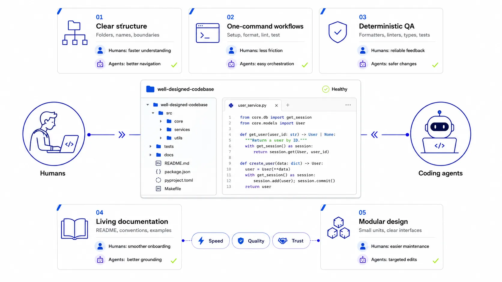
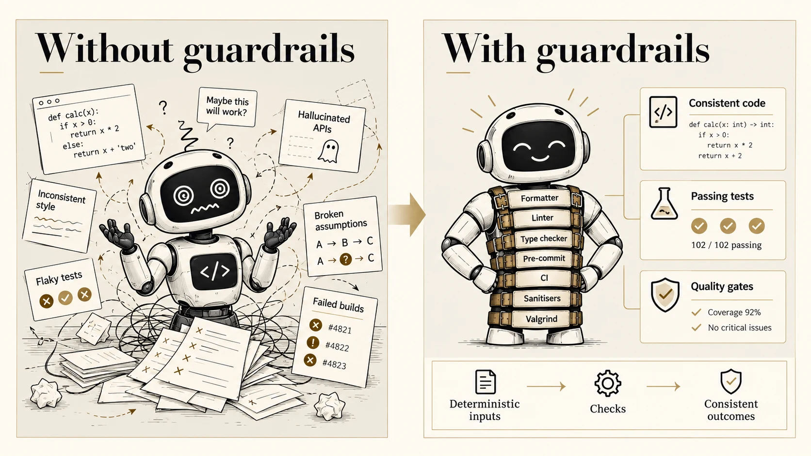
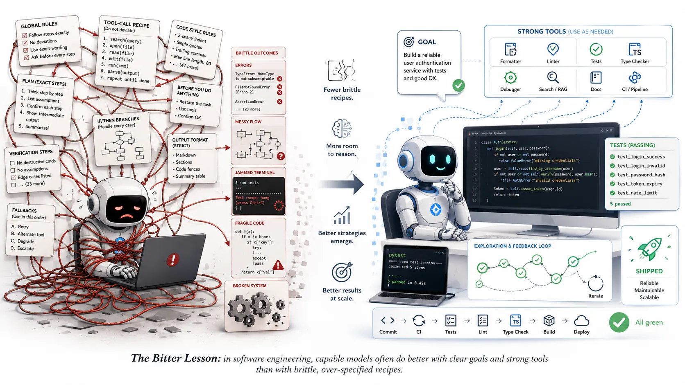
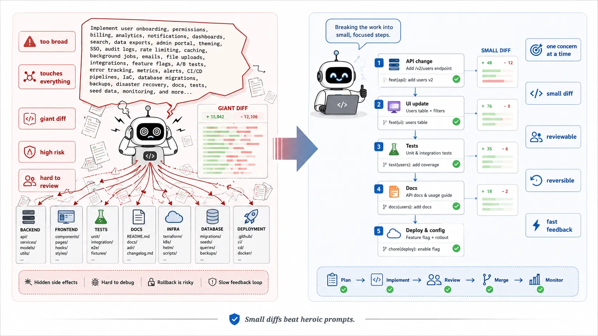
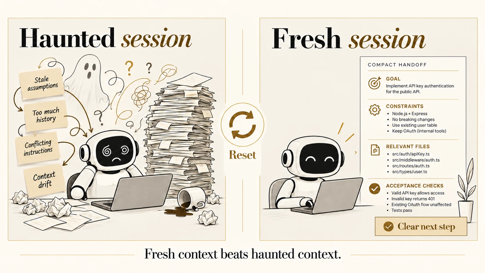
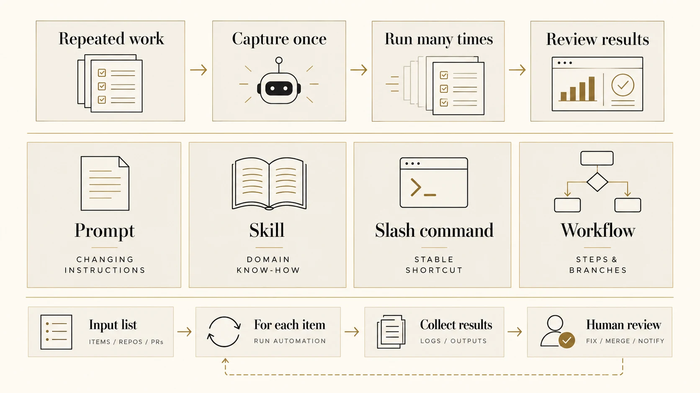
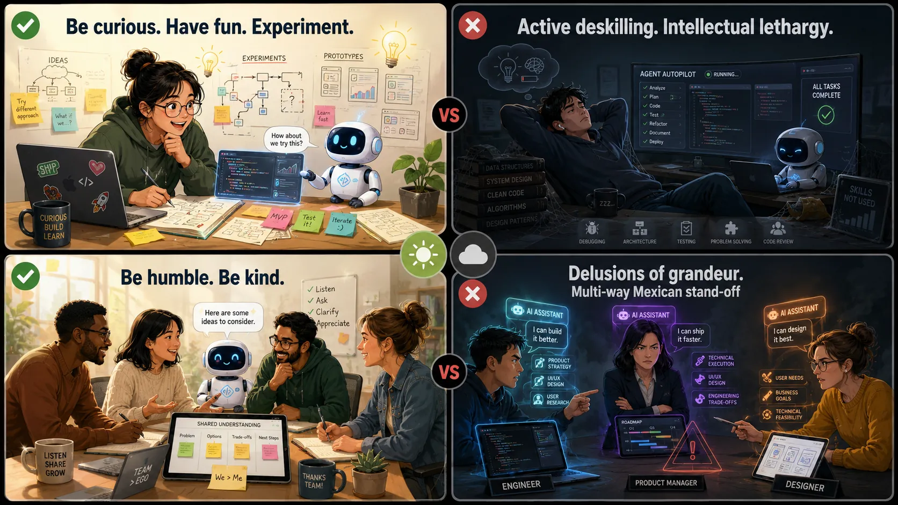

---
format:
  revealjs:
    css: style.css
    theme: simple
    revealjs-plugins:
      - a11y
    revealjs-a11y:
      # 0.2.3's menus introduce ARIA failures; retain our slide-menu handling.
      slide-menu-a11y: false
      menu: false
      # Use the extension's core accessibility fixes without extra UI/shortcuts.
      font-size-controls: false
      font-selection: false
      text-spacing: false
      transcript: false
      slide-change-cue: false
    slide-number: true
    code-line-numbers: false
    preview-links: auto
    keyboard: true
    touch: true
    help: true
    mermaid:
      theme: neutral
    include-in-header: meta-tags.html
    include-after-body: accessibility.html
    link-external-newwindow: true
execute:
  echo: true
  eval: false
keywords: ["agentic-engineering", "coding-agents", "software-engineering", "ai-assisted-development"]
description-meta: "Golden rules for agentic engineering: how to use coding agents to boost productivity without compromising quality. Covers developer experience, deterministic guardrails, intent over ceremony, scope control, session hygiene, meta-automation, tool affordances, and team culture."
license: "CC0 1.0 Universal"
pagetitle: "Golden Rules for Agentic Engineering"
author-meta: "Indrajeet Patil"
date-meta: "2026-10-08"
lang: "en"
dir: "ltr"
image: "media/social-media-card.webp"
image-alt: "Preview image for a presentation about golden rules for agentic engineering"
canonical-url: "https://www.indrapatil.com/agentic-engineering-golden-rules/"
jupyter: python3
---

## Golden Rules for Agentic Engineering {.title-slide-custom .sr-only-heading}

::: {.hero}

[Indrajeet Patil]{.hero-kicker}

::: {aria-hidden="true"}

[golden rules]{.hero-title}

[for agentic engineering]{.hero-title-italic}

:::

[Boost productivity without compromising quality]{.hero-subtitle}

:::

::: {.hero-source}
Source code for these slides can be found [on GitHub](https://github.com/IndrajeetPatil/agentic-engineering-golden-rules/).
All illustrations in this presentation are AI-generated.
:::

::: {.notes}
This is a practical talk, not a theoretical one. The goal is to explore how agentic software engineering can make us faster while still protecting quality.

The illustrations are AI-generated, which is intentional: the topic is hands-on use of AI as a tool.

Invite the audience to think about one area of their daily engineering work where they lose time: finding context, writing repetitive code, coordinating changes, or waiting for feedback.
:::

## Assumptions and expectations

[What I assume, and what you should expect.]{.lede}

:::: {.card-grid .card-grid-3}

::: {.card .card-stone}
[Assumption]{.eyebrow}

[You ship production software]{.card-title}

Tests, deployment, security, and maintenance matter.
:::

::: {.card .card-stone}
[Assumption]{.eyebrow}

[You have used coding agents]{.card-title}

In the IDE or the terminal, however briefly.
:::

::: {.card .card-ink}
[Expectation]{.eyebrow}

[No panacea]{.card-title}

These are principles that sharpen judgement, not a magic recipe.
:::

::::

::: {.notes}
Align expectations. Quality gates such as tests, security, deployment, and maintenance are part of the conversation.

People will have different levels of experience with coding agents; even minimal exposure is enough. The aim is to sharpen judgement, not to sell a magic solution.
:::

## Out of scope

[Good debates, but not today.]{.lede}

:::: {.card-grid .card-grid-3}

::: {.card .card-outline}
[Costs]{.card-title}

Budgeting and return on investment
:::

::: {.card .card-outline}
[Careers]{.card-title}

How roles and skills change
:::

::: {.card .card-outline}
[Policy]{.card-title}

Approved tools, data handling, and restrictions in your organisation
:::

::::

::: {.card .card-ink .card-wide}
[Focus]{.eyebrow}

Leveraging coding agents to boost productivity **without compromising quality**. The quality half matters as much as the speed half.
:::

::: {.notes}
Clarify the boundaries early so the discussion stays productive. Costs, career implications, and policy questions are important, but they are not the focus today.
:::

## Eight golden rules {.smaller}

:::: {.card-grid .card-grid-4 .rule-index}

::: {.card}
[01]{.rule-number}

**DevEx = AgentEx**
:::

::: {.card}
[02]{.rule-number}

**Guardrails over orchestration**
:::

::: {.card}
[03]{.rule-number}

**Intent over ceremony**
:::

::: {.card}
[04]{.rule-number}

**Small, reversible scope**
:::

::: {.card}
[05]{.rule-number}

**Fresh context over haunted context**
:::

::: {.card}
[06]{.rule-number}

**Automate the choreography**
:::

::: {.card}
[07]{.rule-number}

**Know thy tools**
:::

::: {.card}
[08]{.rule-number}

**Curious, humble, kind**
:::

::::

# [Rule 01]{.section-eyebrow} DevEx = AgentEx

If humans hunt for context, agents burn tokens too.

## [01]{.rule-tag} DevEx = AgentEx {.rule-slide}

[What makes a codebase easy for humans makes it cheaper and safer for agents.]{.lede}

{.illustration width="880" height="495" fig-alt="Infographic: humans and coding agents both benefit from a well-designed codebase. Five properties sit around a healthy repository: clear structure (folders, names, boundaries), one-command workflows (setup, format, lint, test), deterministic QA (formatters, linters, types, tests), living documentation (README, conventions, examples), and modular design (small units, clear interfaces). Each brings faster understanding for humans and better navigation or grounding for agents, adding up to speed, quality, and trust."}

::: {.notes}
DevEx equals AgentEx: the same things that make a codebase easy for humans also make it easier and cheaper for agents to work in.

If developers need to hunt through unclear documentation, inconsistent commands, or hidden conventions, agents will struggle too. They burn tokens, make assumptions, or ask for more context.
:::

## DevEx = AgentEx: in practice {.smaller}

:::: {.columns}

::: {.column width="50%"}

::: {.card .card-stone}
[Invest in]{.eyebrow}

- A README that explains how to set up, run, and test
- A short `AGENTS.md`: gotchas, what to read first, and which checks to run
- **One obvious command** per task: `make setup`, `make qa`
- Small modules with clear boundaries
- Stable scripts instead of tribal knowledge
:::

:::

::: {.column width="50%"}

```{.makefile}
# Makefile: one entry point for humans and agents
setup:
	uv sync --frozen

lint:
	uv run ruff check --fix .

type-check:
	uv run ty check

test:
	uv run pytest

qa: lint type-check test security-scan
```

::: {.card .card-ink}
These are not documentation chores. They are **leverage** for every human and every agent who touches the repository.
:::

:::

::::

::: {.source}
See the [AGENTS.md](https://agents.md/) convention.
:::

# [Rule 02]{.section-eyebrow} Guardrails

Fast feedback beats orchestration.

## [02]{.rule-tag} Guardrails {.rule-slide}

[Use a deterministic harness to keep the agent's non-determinism in check.]{.lede}

{.illustration width="880" height="495" fig-alt="Two-panel illustration. Left, without deterministic tooling: a dizzy robot surrounded by inconsistent code style, flaky tests, broken assumptions, hallucinated APIs, random patches, and failed builds that differ every time. Right, with deterministic tooling: a calm robot strapped into a harness of formatter, linter, type checker, pre-commit, CI, sanitisers, and Valgrind, producing consistent code, passing tests, quality gates, and production-safe output. The caption reads from chaos to disciplined execution: deterministic inputs, checks, and outcomes lead to confident delivery."}

::: {.notes}
Guardrails are more important than elaborate orchestration. Fast, deterministic feedback keeps the agent's non-determinism under control.
:::

## Guardrails: in practice {.smaller}

::: {.card .card-stone .diagram-card}

```{mermaid}
%%| eval: true
%%| echo: false
flowchart LR
    A[Agent proposes change] --> B{Deterministic checks}
    B -- fail --> C[Precise error output]
    C --> A
    B -- pass --> D[Human review]
    D --> E[Merge]
```

:::

:::: {.card-grid .card-grid-3}

::: {.card .card-outline}
[The harness]{.eyebrow}

Formatters, linters, type checkers, tests with coverage gates, Git hooks, and security scans
:::

::: {.card .card-ink}
[One command]{.eyebrow}

`make qa` says whether the work is acceptable, and CI runs the **same gates**
:::

::: {.card .card-stone}
[Agents optimise for green]{.eyebrow}

Never lower a threshold or disable a check to get there
:::

::::

::: {.source}
See also [Harness engineering for coding agent users](https://martinfowler.com/articles/harness-engineering.html) (Böckeler, martinfowler.com).
:::

::: {.notes}
An agent can propose changes quickly, but quality comes from the harness around it: tests, linters, type checks, build commands, security scans, and reproducible local setup.

Coverage gates invite filler tests. Ask agents to assert behaviour at the boundaries you own (the outbound request, the streamed output, the logged event), never to execute lines for the sake of coverage.
:::

# [Rule 03]{.section-eyebrow} The Bitter Lesson

Strong models need intent, not ceremony.

## [03]{.rule-tag} Intent over ceremony {.rule-slide}

[Say **what** you want. Do not script **how** to achieve it.]{.lede}

{.illustration width="880" height="495" fig-alt="Two-panel illustration titled The Bitter Lesson. Left: a stressed robot tangled in red strings attached to brittle, over-specified instructions such as global rules, exact plans, tool-call recipes, code style rules, and fallbacks, producing errors, a messy flow, a jammed terminal, fragile code, and a broken system. Right: a calm robot given a clear goal and strong tools (formatter, linter, tests, type checker, debugger, search, docs, CI), iterating through an exploration and feedback loop to shipped, reliable code. Caption: in software engineering, capable models often do better with clear goals and strong tools than with brittle, over-specified recipes."}

::: {.source}
Inspired by Rich Sutton's essay [The Bitter Lesson](http://www.incompleteideas.net/IncIdeas/BitterLesson.html) (2019).
:::

::: {.notes}
The bitter lesson here is that stronger models usually need clearer intent, not more ceremony.
:::

## Intent over ceremony: in practice {.smaller}

:::: {.columns}

::: {.column width="50%"}

::: {.card .card-outline .card-tall}
[Ceremony]{.eyebrow}

*"Open `utils.py`. Find the function on line 40. Add a `try` block. Then open the test file and add three tests. Use single quotes. Do not deviate from these steps."*

Over-specifies the route and leaves no room for the model to reason about a better one.
:::

:::

::: {.column width="50%"}

::: {.card .card-ink .card-tall}
[Intent]{.eyebrow}

*"Fix the failing date-parsing test without changing the public API. Keep the diff small, and explain any trade-off."*

States the **outcome**, the **constraints**, the **acceptance criteria**, and what must **not** change.
:::

:::

::::

::: {.card .card-stone .card-wide}
Specify implementation steps only when they genuinely matter. Otherwise, give the agent a target and strong tools.
:::

# [Rule 04]{.section-eyebrow} Scope Control

Small diffs beat heroic prompts.

## [04]{.rule-tag} Scope control {.rule-slide}

[In brownfield projects, introduce changes in reviewable, reversible chunks.]{.lede}

{.illustration width="880" height="495" fig-alt="Two-panel illustration. Left: a stressed robot receives one enormous prompt covering onboarding, billing, analytics, search, SSO, migrations, and more; it touches backend, frontend, tests, docs, infrastructure, database, and deployment at once, producing a giant diff that is high risk, hard to review, and hard to roll back. Right: a happy robot breaks the work into five small, focused steps (API change, UI update, tests, docs, and deployment configuration), each with a small diff and its own commit, so every change is one concern at a time, reviewable, reversible, and quick to give feedback. Caption: small diffs beat heroic prompts."}

::: {.notes}
In brownfield systems, scope control is the difference between useful automation and an unreviewable mess.
:::

## Scope control: in practice {.smaller}

:::: {.card-grid .card-grid-2}

::: {.card .card-stone}
[Why]{.eyebrow}

Agents can change a lot of code quickly. Reviewers cannot review a lot of code quickly. **Review capacity is the bottleneck**, not generation speed.
:::

::: {.card .card-stone}
[How]{.eyebrow}

Prefer narrow tasks: one bug, one refactor, one test gap, one migration step. Each chunk should be reviewable, testable, and revertible on its own.
:::

::::

::: {.card .card-ink .card-wide}
When the agent discovers broader issues, **capture them as follow-up tasks** instead of expanding the current change indefinitely.
:::

::: {.notes}
Agents are good at making many changes quickly, but reviewers need changes that are small enough to understand.
:::

# [Rule 05]{.section-eyebrow} Session Hygiene

Fresh context beats haunted context.

## [05]{.rule-tag} Session hygiene {.rule-slide}

[Long sessions accumulate stale assumptions. Reset with a compact handoff.]{.lede}

{.illustration width="880" height="495" fig-alt="Two-panel illustration. Left: a haunted session, where a confused robot sits by a laptop showing a long, contradictory chat history, surrounded by sticky notes reading stale assumptions, too much history, conflicting instructions, and context drift. Centre: a reset arrow. Right: a fresh session that starts from a compact handoff listing the goal, constraints, relevant files, and acceptance checks, and proceeds with a clear plan. Caption: fresh context beats haunted context."}

::: {.notes}
Every correction, abandoned approach, and reversed decision stays in the context window. After enough of them, the agent is reasoning over contradictions.
:::

## Session hygiene: in practice {.smaller}

:::: {.columns}

::: {.column width="50%"}

::: {.card .card-stone}
[Signs of a haunted session]{.eyebrow}

- The agent revives an approach you already rejected
- It confuses earlier and current requirements
- You keep repeating the same correction
- The conversation outgrew the task it started with
:::

:::

::: {.column width="50%"}

::: {.card .card-ink}
[A compact handoff]{.eyebrow}

- **Goal**: the outcome, in one sentence
- **Constraints**: what must not change
- **Relevant files**: where to start looking
- **Acceptance checks**: how you will know it is done
:::

:::

::::

::: {.card .card-outline .card-wide}
One task per session, and one Git worktree per parallel task. Keep durable knowledge in the repository (for example, `AGENTS.md`) rather than in chat history.
:::

::: {.source}
See [Effective context engineering for AI agents](https://www.anthropic.com/engineering/effective-context-engineering-for-ai-agents) (Anthropic).
:::

# [Rule 06]{.section-eyebrow} Meta-automation

Automate repeated agent choreography.

## [06]{.rule-tag} Meta-automation {.rule-slide}

[Capture once. Run many times.]{.lede}

{.illustration width="760" height="507" fig-alt="Diagram of meta-automation: manual, repeated work is captured once and run many times, giving automated execution and consistent outcomes. A table compares four ways to define it. Prompt: best for dependency updates, checks, and configuration changes, when instructions change often. Skill: best for tasks needing domain know-how or multi-step execution, when the same procedure repeats regularly. Slash command: a shortcut for a stable, repeatable sequence you trigger often. Workflow: complex, multi-step processes with logic and branches that capture recurring patterns at scale. A final row shows execution with loops: define an input list, run the automation for each item, collect results, then review and act."}

::: {.notes}
Once a useful agent workflow repeats, automate the choreography around it.
:::

## Meta-automation: in practice {.smaller}

::: {.card .card-stone .card-wide}
If you repeatedly ask an agent to *update dependencies → run `make qa` → fix what broke → open a PR*, that sequence belongs in a versioned prompt file, a skill, a slash command, or a workflow.
:::

:::: {.card-grid .card-grid-2}

::: {.card .card-ink}
[Automate]{.eyebrow}

The coordination: gathering context, running the same checks, formatting the same report, fanning out over many repositories.
:::

::: {.card .card-outline}
[Keep human]{.eyebrow}

The judgement: evaluating results, making trade-offs, and deciding what ships. Run unattended agents only in isolated sandboxes with scoped credentials.
:::

::::

::: {.notes}
The goal is not to automate judgement away. The goal is to reduce repetitive coordination so humans spend more time evaluating results, making trade-offs, and deciding what should ship.
:::

# [Rule 07]{.section-eyebrow} Know Thy Tools

Sometimes the unlock is a hidden tool affordance.

## [07]{.rule-tag} Know thy tools {.smaller}

[When results are poor, ask whether the agent had the right **context**, the right **tools**, and the right **feedback**.]{.lede}

::: {.table-card}

| Coding agent | Affordances users often miss |
|--------------|------------------------------|
| **Claude Code** | `ultrathink` keyword · worktree lifecycle management · plan mode · hooks · skills · subagents |
| **GitHub Copilot CLI** | `/chronicle` · rubber-duck review · voice mode · custom agents · cloud agent delegation |
| **Any agent** | Permission allowlists · custom instructions · MCP servers · session resume and compaction |

:::

::: {.card .card-ink .card-wide}
Read the changelog: a release note can remove a bottleneck you have been working around for months.
:::

::: {.source}
See [Claude Code best practices](https://code.claude.com/docs/en/best-practices) and [Using GitHub Copilot CLI](https://docs.github.com/en/copilot/how-tos/use-copilot-agents/use-copilot-cli).
:::

::: {.notes}
Sometimes the limiting factor is not the model; it is the tool interface available to the model.

Agents perform better when they can inspect files, run commands, search the repository, execute tests, and see failures. If a tool is hidden, blocked, or awkward, the agent may appear less capable than it really is.
:::

# [Rule 08]{.section-eyebrow} Be Curious. Be Humble. Be Kind.

AI is not an excuse to become incompetent or disagreeable.

## [08]{.rule-tag} Curious, humble, kind {.rule-slide}

[AI should make us better teammates, not careless or difficult ones.]{.lede}

{.illustration width="880" height="495" fig-alt="Four-panel illustration contrasting good and bad habits. Top left, marked good: be curious, have fun, experiment, showing a developer sketching ideas and prototypes with a friendly robot. Top right, marked bad: active deskilling and intellectual lethargy, showing a developer asleep while an agent runs on autopilot. Bottom left, marked good: be humble, be kind, showing a team listening and clarifying shared understanding together. Bottom right, marked bad: delusions of grandeur, showing an engineer, a product manager, and a designer in a stand-off, each claiming their AI assistant can do the others' jobs."}

::: {.notes}
Be curious about what the tools can do, humble about their limits, and kind in how we review agent-generated work and each other's experiments.
:::

## Curious, humble, kind: in practice {.smaller}

:::: {.card-grid .card-grid-3}

::: {.card .card-stone}
[Curious]{.card-title}

Experiment, prototype, and keep learning the fundamentals the agent is standing on.
:::

::: {.card .card-stone}
[Humble]{.card-title}

Agents are confidently wrong. So are we. Verify before you trust, including your own prompt.
:::

::: {.card .card-stone}
[Kind]{.card-title}

Review agent-generated work as carefully as human work, and review humans as kindly as ever.
:::

::::

::: {.card .card-ink .card-wide}
**AI does not remove responsibility.** You still own the design, the code, the tests, the security implications, and the communication with your team.
:::

# Making it stick

## Code generation is the easy part {.smaller}

[Everything around it needs planning, especially in teams.]{.lede}

:::: {.card-grid .card-grid-2}

::: {.card .card-stone}
[Share]{.eyebrow}

Pool your team's tips and tricks for agentic coding. Someone has already solved your annoyance.
:::

::: {.card .card-stone}
[Fix pain points]{.eyebrow}

The best way to upskill is to identify a real pain point (slow tests, unclear setup, flaky workflows) and resolve it.
:::

::: {.card .card-stone}
[Frontload planning]{.eyebrow}

Task division, coordination, and reviewability matter more when everyone has an agent.
:::

::: {.card .card-stone}
[Challenge your habits]{.eyebrow}

If you are already set in your ways with coding agents, these tools change monthly. So should your workflow.
:::

::::

::: {.notes}
Code generation is often the easy part. The hard part is planning work in a team: dividing tasks, coordinating changes, preserving quality, and making results reviewable.
:::

## One thing to do this week

::: {.card .card-ink .card-callout}
Pick **one** workflow and make it better for humans and agents alike.
:::

:::: {.card-grid .card-grid-4}

::: {.card .card-outline}
Add a single `make qa` command
:::

::: {.card .card-outline}
Write down agent instructions
:::

::: {.card .card-outline}
Turn a repeated prompt into a reusable one
:::

::: {.card .card-outline}
Remove one source of context friction
:::

::::

::: {.notes}
Reinforce the theme: use coding agents to move faster, but make the system around them strong enough that quality improves rather than erodes.
:::

## Further reading {.smaller}

::: {.reading-list}

- Willison, S. [Agentic Engineering Patterns](https://simonwillison.net/guides/agentic-engineering-patterns/).

- Anthropic. [Building effective agents](https://www.anthropic.com/engineering/building-effective-agents).

- Anthropic. [Effective context engineering for AI agents](https://www.anthropic.com/engineering/effective-context-engineering-for-ai-agents).

- Anthropic. [Claude Code best practices](https://code.claude.com/docs/en/best-practices).

- Böckeler, B. [Harness engineering for coding agent users](https://martinfowler.com/articles/harness-engineering.html). martinfowler.com.

- Beck, K. [Augmented coding: beyond the vibes](https://tidyfirst.substack.com/p/augmented-coding-beyond-the-vibes).

- Sutton, R. (2019). [The Bitter Lesson](http://www.incompleteideas.net/IncIdeas/BitterLesson.html).

- [AGENTS.md](https://agents.md/): a simple, open format for guiding coding agents.

:::

# Thank You

Go forth and delegate responsibly.

<br>

::: {style="text-align: center; font-size: 0.7em;"}

Check out my other [slide decks](https://www.indrapatil.com/presentations/) on software development best practices

:::

::: {style="text-align: center; font-size: 1em;"}

<a class="deck-icon-link" href="https://www.linkedin.com/in/indrajeet-patil-ph-d-397865174/" aria-label="LinkedIn"><span class="deck-icon deck-icon-brands-linkedin" aria-hidden="true"></span></a>
&nbsp;&nbsp;
<a class="deck-icon-link" href="http://github.com/IndrajeetPatil" aria-label="GitHub"><span class="deck-icon deck-icon-brands-github" aria-hidden="true"></span></a>
&nbsp;&nbsp;
<a class="deck-icon-link" href="mailto:patilindrajeet.science@gmail.com" aria-label="Email"><span class="deck-icon deck-icon-solid-envelope" aria-hidden="true"></span></a>

:::
